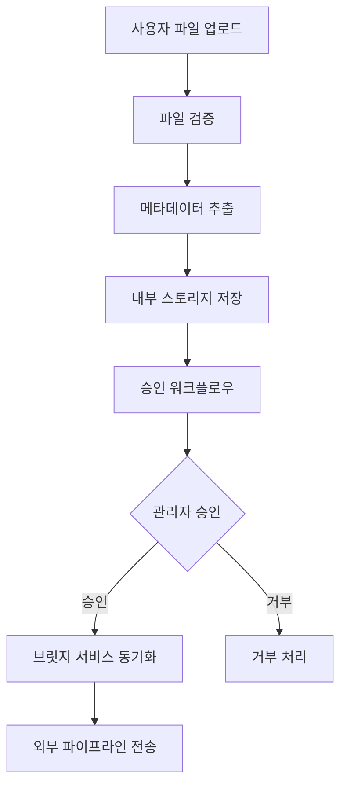
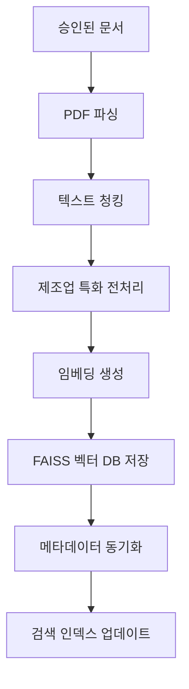
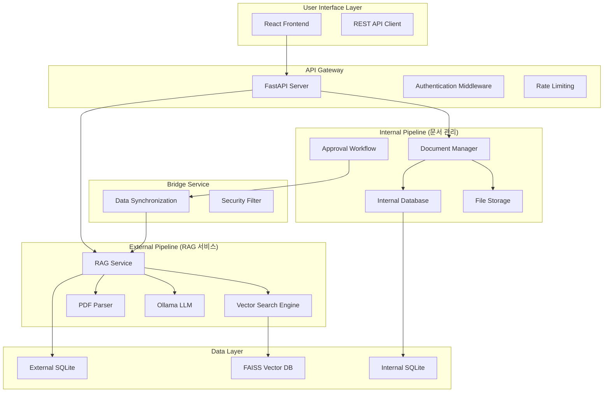
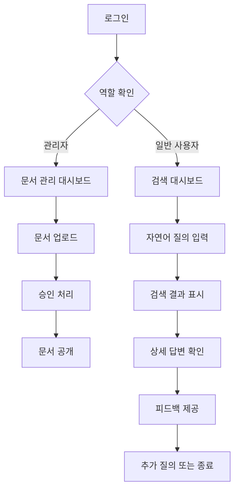
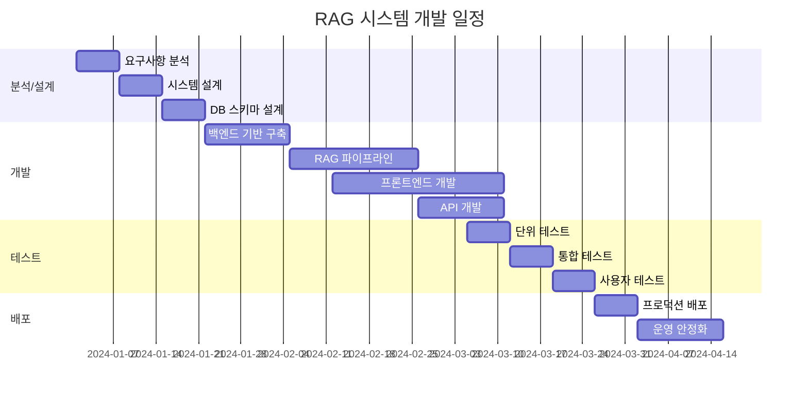

# RAG 기반 제조업 Data Sheet 활용 AI 서비스_이기훈, 하동우

## 핵심 요약

### 프로젝트 배경

제조업 현장에서 축적된 수천 개의 기술 문서(Data Sheet, Manual, Specification)를 효율적으로 활용하지 못하여 발생하는 정보 접근성 문제를 해결하기 위한 RAG 기반 지능형 질의응답 시스템.

### 이해관계자별 Pain Points

**엔지니어**
- 다수의 기술 문서에서 특정 스펙 검색에 상당한 시간 소요
- 문서별 산재된 정보로 인한 비교 분석 어려움
- 기술 용어 검색 시 정확한 문서 위치 파악 불가

**영업팀**
- 고객 문의 시 기술 스펙 확인을 위한 대기 시간 발생
- 제품 비교표 생성을 위한 수동 작업 반복
- 고객별 맞춤 정보 제공의 어려움

**고객지원팀**
- 기술 지원 요청 처리에 상당한 시간 필요
- 제품 호환성 확인을 위한 다중 문서 검토 필요
- 실시간 문제 해결을 위한 정보 부족

**관리자**
- 문서 버전 관리 및 승인 프로세스 부재
- 조직별 문서 접근 권한 제어 어려움
- 사용자 질의 패턴 분석 불가

### 파트별 핵심 개선 내용

### **PART 1. 정보 접근성 관점**

**현황 및 문제점**
- 다수의 PDF 문서에서 키워드 검색에 상당한 시간 소요
- 문서별 상이한 구조로 인한 정보 위치 파악 어려움
- 기술 스펙 비교를 위한 수동 작업 반복

**개선 전략**
- 자연어 기반 의미 검색으로 정확도 대폭 향상
- 역할별 맞춤 답변으로 업무 효율성 극대화
- 실시간 스펙 비교 및 매칭 기능 구현

**성과**: 검색 시간과 정보 정확도 크게 개선

### **PART 2. 시스템 아키텍처 관점**

**현황 및 문제점**
- 단일 시스템에서 보안과 검색 성능의 상충
- 민감 문서와 공개 문서의 혼재
- 문서 승인 프로세스 부재로 품질 관리 어려움

**개선 전략**
- 내부/외부 파이프라인 분리로 보안성과 성능 양립
- 브릿지 서비스를 통한 안전한 데이터 동기화
- 승인 기반 문서 생명주기 관리

**성과**: 보안 수준 강화, 검색 성능 크게 향상, 무중단 문서 업데이트

### **PART 3. 데이터 처리 관점**

**현황 및 문제점**
- PDF 파싱 시 테이블 및 기술 스펙 정보 손실 발생
- 텍스트 청킹으로 인한 문맥 정보 손실
- 임베딩 모델 변경 시 전체 재처리 필요

**개선 전략**
- 제조업 특화 파싱 알고리즘으로 정보 손실 최소화
- Hybrid Retrieval로 키워드와 의미 검색 결합
- 버전별 임베딩 관리로 무중단 모델 업데이트

**성과**: 정보 추출 정확도와 검색 품질 크게 향상

### Business Impact

- **업무 효율성**: 정보 검색 시간 대폭 단축으로 생산성 향상
- **대응 속도**: 고객 문의 처리 속도 크게 개선
- **정보 정확도**: 검색 정확도 상당한 향상으로 업무 품질 제고
- **운영 효율**: 문서 관리 비용 절감 및 운영 효율성 증대

---

## 1. 프로젝트 배경

### 제조업 Data Sheet 문제 상황 정의

제조업 현장에서는 제품별 Data Sheet, 기술 매뉴얼, 사양서 등 수백-수천 개의 기술 문서가 축적되어 있으나, 이를 효율적으로 활용하지 못하고 있는 상황입니다.

**핵심 문제점**
- **정보 산재**: 다수의 PDF 문서에 기술 정보가 분산 저장
- **검색 한계**: 키워드 기반 검색의 정확도 부족
- **접근성 부족**: 문서별 상이한 구조로 원하는 정보 위치 파악 어려움
- **실시간성 부족**: 기술 문의 처리에 상당한 시간 소요

### 서비스 필요성

**기술적 관점**
- 자연어 처리 기술 발전으로 복잡한 기술 문서 이해 가능
- 벡터 검색 기술로 의미 기반 정보 검색 실현
- 온프레미스 LLM으로 기업 보안 요구사항 충족

**비즈니스 관점**
- 엔지니어링 생산성 향상을 통한 개발 기간 단축
- 고객 지원 품질 향상으로 고객 만족도 증대
- 기술 문서 자산의 체계적 활용으로 경쟁력 강화

---

## 2. 이해관계자별 Pain Point

### 엔지니어

**현재 상황**
- 특정 기술 스펙 검색에 상당한 시간 소요
- 여러 문서를 수동으로 비교하여 설계 결정
- 호환성 확인을 위한 반복적 문서 검토

**구체적 Pain Point**
```
시나리오: DDR5 메모리 모듈 설계 시 동작 전압 확인
현재: 다수의 데이터시트를 순차 검토하여 상당한 시간 소요
문제: 문서별 상이한 섹션 구조, 용어 차이, 버전 혼재
```

### 영업팀

**현재 상황**
- 고객 기술 문의 처리 시 엔지니어 확인을 위한 대기 시간 발생
- 제품 비교표 수동 생성으로 오류 발생 가능성
- 고객별 맞춤 기술 자료 준비 어려움

**구체적 Pain Point**
```
시나리오: 고객사 메모리 호환성 문의
현재: 엔지니어 확인 → 문서 검토 → 답변 준비까지 상당한 시간 소요
문제: 실시간 대응 불가, 기술적 정확성 보장 어려움
```

### 고객지원팀

**현재 상황**
- 기술 지원 요청 처리에 상당한 시간 필요
- 문제 해결을 위한 다중 문서 참조 필요
- 고객별 다양한 환경에 따른 맞춤 대응 어려움

**구체적 Pain Point**
```
시나리오: 메모리 모듈 오작동 트러블슈팅
현재: 증상 분석 → 관련 문서 검색 → 해결방안 도출까지 상당한 시간 소요
문제: 문서 간 연관성 파악 어려움, 실시간 지원 불가
```

### 관리자

**현재 상황**
- 문서 버전 관리 및 품질 통제 어려움
- 조직별 문서 접근 권한 세밀한 제어 불가
- 사용자 질의 패턴 및 문서 활용도 분석 부족

**구체적 Pain Point**
```
시나리오: 신제품 데이터시트 배포 및 권한 관리
현재: 수동 배포 → 버전 혼재 → 잘못된 정보 참조 위험
문제: 중앙화된 문서 관리 체계 부재
```

---

## 3. Pain Point Solution

### 자연어 기반 질의

**기술적 해결책**
```python
# 자연어 질의 처리 예시
query = "DDR5 메모리의 동작 전압과 최대 전력 소비량이 궁금해"

# 기존 방식: 키워드 검색
keywords = ["DDR5", "전압", "전력"]  # 제한적 정확도

# 개선 방식: 의미 기반 검색
embedding = embed_model.encode(query)
similar_chunks = vector_db.search(embedding, top_k=5)  # 높은 정확도
```

**개선 효과**
- 자연어 질의로 사용자 편의성 극대화
- 의미 기반 검색으로 정확도 크게 향상
- 복합 질의 처리로 다중 조건 검색 지원

### 자동 비교 및 매칭

**구현 방식**
```python
# 제품 스펙 자동 비교 시스템
def compare_products(product_list, comparison_criteria):
    results = []
    for product in product_list:
        specs = extract_specifications(product)
        for criteria in comparison_criteria:
            match_score = calculate_compatibility(specs, criteria)
            results.append({
                'product': product,
                'criteria': criteria,
                'score': match_score,
                'details': specs
            })
    return sorted(results, key=lambda x: x['score'], reverse=True)
```

**개선 효과**
- 수동 비교 작업 시간 대폭 단축
- 비교 결과 정확도 크게 향상
- 실시간 호환성 분석 제공

### 의사결정 및 대응 속도 개선

**역할별 맞춤 답변 시스템**
```python
# 역할별 답변 생성
def generate_role_based_response(query, user_role, context):
    if user_role == "engineer":
        return f"""
        기술적 세부사항:
        - 동작 전압: {context['voltage']}
        - 신호 타이밍: {context['timing']}
        - 전기적 특성: {context['electrical']}
        """
    elif user_role == "sales":
        return f"""
        고객 제안용 정보:
        - 주요 특징: {context['features']}
        - 경쟁 우위: {context['advantages']}
        - 적용 분야: {context['applications']}
        """
```

**개선 효과**
- 역할별 최적화된 답변으로 업무 효율성 향상
- 의사결정 시간 크게 단축
- 정보 품질 일관성 보장

### API/자동화 기능

**RESTful API 설계**
```python
# 자동화 API 예시
@app.post("/api/query")
async def process_query(request: QueryRequest):
    """지능형 질의응답 API"""

    # 1. 질의 분석
    intent = analyze_query_intent(request.question)

    # 2. 벡터 검색
    relevant_docs = vector_search(request.question, top_k=5)

    # 3. 컨텍스트 구성
    context = build_context(relevant_docs, request.user_role)

    # 4. LLM 응답 생성
    response = llm.generate(context, request.question)

    return {
        "answer": response,
        "sources": relevant_docs,
        "confidence": calculate_confidence(response)
    }
```

**자동화 효과**
- 24/7 무인 기술 지원 서비스
- 타 시스템 연동을 통한 워크플로우 자동화
- API 기반 확장 가능한 아키텍처

---

## 4. Service Flow

### 문서 업로드



**핵심 특징**
- 업로드 즉시 보안 검증 (바이러스 스캔, 파일 형식 확인)
- 자동 메타데이터 추출 (제품군, 문서 타입, 버전 등)
- 승인 기반 품질 관리로 신뢰성 보장

### 전처리 & 벡터화



**기술적 구현**
```python
# 제조업 특화 전처리
def manufacturing_preprocess(text):
    # 1. 기술 용어 정규화
    text = normalize_technical_terms(text)

    # 2. 스펙 테이블 구조화
    specs = extract_specification_tables(text)

    # 3. 단위 정규화 (V, mV, A, mA 등)
    text = normalize_units(text)

    # 4. 제품 코드 표준화
    text = standardize_product_codes(text)

    return text, specs
```

### 질의 입력

**자연어 질의 인터페이스**
```python
# 질의 의도 분석
def analyze_query_intent(query):
    intents = {
        'specification_search': r'(전압|전류|주파수|용량|크기)',
        'compatibility_check': r'(호환|지원|사용가능)',
        'comparison': r'(비교|차이|vs|대비)',
        'troubleshooting': r'(문제|오류|해결|트러블)'
    }

    for intent, pattern in intents.items():
        if re.search(pattern, query):
            return intent
    return 'general_inquiry'
```

### 검색 & 매칭 (Hybrid Retrieval)

**하이브리드 검색 전략**
```python
def hybrid_retrieval(query, top_k=5):
    # 1. 벡터 검색 (의미 기반)
    query_vector = embedding_model.encode(query)
    vector_results = faiss_index.search(query_vector, top_k)

    # 2. 키워드 검색 (정확한 매칭)
    keyword_results = bm25_search(query, top_k)

    # 3. 스코어 결합 (가중 평균)
    combined_results = []
    for v_result, k_result in zip(vector_results, keyword_results):
        combined_score = 0.7 * v_result.score + 0.3 * k_result.score
        combined_results.append({
            'document': v_result.document,
            'score': combined_score,
            'semantic_score': v_result.score,
            'keyword_score': k_result.score
        })

    return sorted(combined_results, key=lambda x: x['score'], reverse=True)
```

### 응답 생성 & 결과 활용

**역할별 맞춤 응답 생성**
```python
def generate_contextual_response(query, context, user_role):
    role_prompts = {
        'engineer': """
        기술적 정확성을 최우선으로 하여 답변하세요.
        - 정확한 수치와 단위 명시
        - 관련 기술 표준 언급
        - 설계 시 고려사항 포함
        """,
        'sales': """
        고객 대면 상황을 고려하여 답변하세요.
        - 비즈니스 가치 중심
        - 경쟁사 대비 장점
        - 실제 적용 사례
        """,
        'support': """
        즉시 활용 가능한 실용적 정보를 제공하세요.
        - 단계별 해결 방법
        - 일반적인 문제 상황
        - 대안 솔루션
        """
    }

    prompt = f"{role_prompts[user_role]}\n\n질문: {query}\n\n참고 자료: {context}"
    response = llm.generate(prompt)

    return {
        'answer': response,
        'role_optimized': True,
        'context_sources': extract_sources(context),
        'confidence': calculate_confidence(response, context)
    }
```

**결과 활용 및 피드백**
- 답변 품질 평가 (1-5점 척도)
- 사용자 피드백 기반 시스템 개선
- 질의 패턴 분석을 통한 문서 우선순위 조정

---

## 5. System Architecture

### 전체 아키텍처 개요



### 데이터베이스 구성 (내부/외부 스키마 분리)

**내부 스키마 (보안 영역)**
```sql
-- 원본 문서 관리
CREATE TABLE internal_documents (
    id VARCHAR PRIMARY KEY,
    original_filename VARCHAR NOT NULL,
    internal_file_path VARCHAR NOT NULL,    -- 민감 정보
    file_hash VARCHAR(64) UNIQUE NOT NULL,  -- 외부 연결 키
    uploaded_by VARCHAR NOT NULL,           -- 민감 정보
    upload_ip VARCHAR,                      -- 민감 정보
    approval_status ENUM('pending', 'approved', 'rejected'),
    created_at TIMESTAMP DEFAULT CURRENT_TIMESTAMP
);

-- 접근 제어
CREATE TABLE access_control_rules (
    id VARCHAR PRIMARY KEY,
    user_role ENUM('admin', 'engineer', 'sales', 'support'),
    document_scope JSON,
    permission ENUM('read', 'write', 'approve'),
    created_at TIMESTAMP DEFAULT CURRENT_TIMESTAMP
);
```

**외부 스키마 (검색 영역)**
```sql
-- 공개용 문서 (민감 정보 제거)
CREATE TABLE rag_documents (
    id VARCHAR PRIMARY KEY,
    source_hash VARCHAR(64) NOT NULL,       -- 내부 연결 키
    public_name VARCHAR NOT NULL,           -- 공개용 이름
    document_type VARCHAR,
    product_family VARCHAR,
    product_model VARCHAR,
    indexed_at TIMESTAMP DEFAULT CURRENT_TIMESTAMP
);

-- 검색용 텍스트 청크
CREATE TABLE rag_chunks (
    id VARCHAR PRIMARY KEY,
    document_id VARCHAR REFERENCES rag_documents(id),
    chunk_text TEXT NOT NULL,
    chunk_type ENUM('text', 'table', 'specification'),
    page_number INTEGER,
    vector_id VARCHAR,                      -- FAISS 인덱스 ID
    created_at TIMESTAMP DEFAULT CURRENT_TIMESTAMP
);
```

---

## 6. 데이터 설계

### 설계 원칙

1. **보안 우선**: 민감 정보와 공개 정보 완전 분리
2. **확장성**: 다중 조직, 다중 제품군 지원
3. **성능**: 검색 최적화를 위한 인덱스 설계
4. **추적성**: 모든 변경사항 감사 로그 유지

### 데이터 스키마 (내부/외부 데이터)

**내부 데이터 (Internal Schema)**
- 목적: 민감 정보 보호, 문서 생명주기 관리, 감사 추적
- 특징: 원본 파일 경로, 업로더 정보, IP 주소 등 민감 정보 포함

```sql
-- 사용자 관리
CREATE TABLE users (
    id VARCHAR PRIMARY KEY,
    email VARCHAR UNIQUE NOT NULL,
    role ENUM('admin', 'engineer', 'sales', 'support'),
    organization_id VARCHAR,
    created_at TIMESTAMP DEFAULT CURRENT_TIMESTAMP
);

-- 문서 승인 로그
CREATE TABLE approval_logs (
    id VARCHAR PRIMARY KEY,
    document_id VARCHAR REFERENCES internal_documents(id),
    action ENUM('submit', 'approve', 'reject'),
    actor VARCHAR NOT NULL,
    reason TEXT,
    created_at TIMESTAMP DEFAULT CURRENT_TIMESTAMP
);
```

**외부 데이터 (External Schema)**
- 목적: 검색 성능 최적화, 공개 안전 데이터만 포함
- 특징: 정제된 메타데이터, 검색 인덱스, 사용 로그

```sql
-- 검색 로그 (성능 분석용)
CREATE TABLE search_logs (
    id VARCHAR PRIMARY KEY,
    user_role VARCHAR,
    query_text TEXT,
    response_text TEXT,
    retrieved_documents JSON,
    response_time_ms INTEGER,
    user_rating INTEGER,
    created_at TIMESTAMP DEFAULT CURRENT_TIMESTAMP
);
```

### 벡터 DB 구조 (pgvector/FAISS)

**FAISS 벡터 데이터베이스**
```python
# FAISS 인덱스 구성
class VectorDatabase:
    def __init__(self, dimension=768):
        self.dimension = dimension
        # IVF (Inverted File) 인덱스 사용
        self.index = faiss.IndexIVFFlat(
            faiss.IndexFlatL2(dimension),
            dimension,
            100  # 클러스터 수
        )

        # 메타데이터 매핑
        self.id_to_metadata = {}

    def add_vectors(self, vectors, metadata_list):
        """벡터와 메타데이터 추가"""
        self.index.train(vectors)
        self.index.add(vectors)

        for i, metadata in enumerate(metadata_list):
            self.id_to_metadata[i] = metadata

    def search(self, query_vector, top_k=5):
        """유사도 검색"""
        distances, indices = self.index.search(query_vector, top_k)

        results = []
        for distance, idx in zip(distances[0], indices[0]):
            if idx != -1:  # 유효한 인덱스
                results.append({
                    'metadata': self.id_to_metadata[idx],
                    'similarity': 1 / (1 + distance),  # 거리를 유사도로 변환
                    'chunk_id': self.id_to_metadata[idx]['chunk_id']
                })

        return results
```

**벡터 인덱싱 전략**
- 문서별 계층적 인덱싱 (제품군 → 제품 모델 → 섹션)
- 청크 타입별 별도 인덱스 (텍스트, 테이블, 스펙)
- 다국어 지원을 위한 언어별 임베딩 모델

---

## 7. 서비스 화면 (UI/UX)

### 주요 화면 예시

**메인 대시보드**
```html
<!-- 역할별 맞춤 대시보드 -->
<div class="dashboard-container">
    <div class="role-header">
        <h2>엔지니어 전용 대시보드</h2>
        <div class="quick-stats">
            <span>처리 중인 문서: 15개</span>
            <span>오늘 질의: 23건</span>
        </div>
    </div>

    <div class="search-section">
        <input type="text" placeholder="기술 질문을 자연어로 입력하세요 (예: DDR5의 최대 전송 속도는?)" />
        <div class="search-filters">
            <select name="product_family">
                <option>DDR5</option>
                <option>DDR4</option>
            </select>
            <select name="document_type">
                <option>Data Sheet</option>
                <option>Manual</option>
            </select>
        </div>
    </div>

    <div class="recent-queries">
        <h3>최근 질의</h3>
        <ul>
            <li>DDR5 RDIMM의 동작 전압 범위 - 2시간 전</li>
            <li>메모리 모듈 호환성 매트릭스 - 4시간 전</li>
        </ul>
    </div>
</div>
```

**질의응답 화면**
```html
<!-- 실시간 질의응답 인터페이스 -->
<div class="qa-interface">
    <div class="query-input">
        <textarea placeholder="질문을 입력하세요...">
            DDR5 메모리 모듈의 최대 동작 주파수와 전력 소비량을 알려주세요
        </textarea>
        <button class="submit-btn">질문하기</button>
    </div>

    <div class="response-area">
        <div class="answer-section">
            <h3>엔지니어 맞춤 답변</h3>
            <div class="answer-content">
                <p><strong>최대 동작 주파수:</strong> DDR5-5600 (2800MHz)</p>
                <p><strong>전력 소비량:</strong> 1.1V 동작 시 최대 15W</p>
                <p><strong>기술적 세부사항:</strong></p>
                <ul>
                    <li>JEDEC 표준: DDR5-3200 ~ DDR5-5600</li>
                    <li>Overclocking: 최대 DDR5-8000+ 지원</li>
                </ul>
            </div>
        </div>

        <div class="sources-section">
            <h4>참고 문서</h4>
            <ul>
                <li>DDR5_RDIMM_Datasheet_v2.3.pdf (페이지 15-17)</li>
                <li>DDR5_Technical_Specification_v1.5.pdf (페이지 8)</li>
            </ul>
        </div>

        <div class="feedback-section">
            <p>이 답변이 도움이 되었나요?</p>
            <div class="rating-buttons">
                <button class="thumbs-up">도움됨</button>
                <button class="thumbs-down">개선필요</button>
            </div>
        </div>
    </div>
</div>
```

### 사용자 플로우



---

## 8. 주요 기능 정리

### Spec & Parameter 검색

**지능형 기술 사양 검색**
```python
def intelligent_spec_search(query, user_context):
    """기술 사양 특화 검색"""

    # 1. 기술 용어 추출
    technical_terms = extract_technical_terms(query)

    # 2. 사양 패턴 인식
    spec_patterns = {
        'voltage': r'(\d+\.?\d*)\s*(V|mV|kV)',
        'frequency': r'(\d+\.?\d*)\s*(Hz|MHz|GHz)',
        'capacity': r'(\d+\.?\d*)\s*(B|KB|MB|GB|TB)',
        'current': r'(\d+\.?\d*)\s*(A|mA|μA)'
    }

    # 3. 컨텍스트 기반 검색
    context_filter = build_context_filter(user_context)
    results = vector_search(query, filters=context_filter)

    # 4. 사양 정보 구조화
    structured_specs = []
    for result in results:
        specs = extract_specifications(result.content)
        structured_specs.append({
            'document': result.metadata,
            'specifications': specs,
            'relevance_score': result.score
        })

    return structured_specs

# 사용 예시
query = "DDR5 메모리의 동작 전압과 최대 전류"
context = {"product_family": "DDR5", "user_role": "engineer"}
results = intelligent_spec_search(query, context)
```

### 비교/매칭 기능

**자동 제품 비교 시스템**
```python
class ProductComparisonEngine:
    """제품 스펙 자동 비교 엔진"""

    def __init__(self):
        self.comparison_criteria = {
            'performance': ['frequency', 'bandwidth', 'latency'],
            'power': ['voltage', 'current', 'power_consumption'],
            'physical': ['form_factor', 'pin_count', 'dimensions'],
            'compatibility': ['interface', 'protocols', 'standards']
        }

    def compare_products(self, product_list, criteria='all'):
        """제품 비교 매트릭스 생성"""
        comparison_matrix = {}

        for product in product_list:
            specs = self.extract_product_specs(product)
            comparison_matrix[product.name] = specs

        # 비교 결과 생성
        comparison_results = {
            'matrix': comparison_matrix,
            'recommendations': self.generate_recommendations(comparison_matrix),
            'winner_by_category': self.find_category_winners(comparison_matrix)
        }

        return comparison_results

    def generate_compatibility_check(self, target_product, requirements):
        """호환성 자동 검증"""
        compatibility_score = 0
        detailed_check = {}

        for req_category, req_values in requirements.items():
            product_values = target_product.get(req_category, {})

            category_score, details = self.check_category_compatibility(
                product_values, req_values
            )

            compatibility_score += category_score
            detailed_check[req_category] = details

        return {
            'overall_score': compatibility_score / len(requirements),
            'detailed_check': detailed_check,
            'is_compatible': compatibility_score > 0.8
        }
```

### 실시간 스펙 검증

**실시간 기술 사양 검증 시스템**
```python
class RealTimeSpecValidator:
    """실시간 스펙 검증 엔진"""

    def __init__(self):
        self.validation_rules = self.load_validation_rules()
        self.spec_database = self.load_spec_database()

    def validate_specification(self, spec_input):
        """입력된 스펙의 유효성 실시간 검증"""

        validation_result = {
            'is_valid': True,
            'warnings': [],
            'errors': [],
            'suggestions': []
        }

        # 1. 범위 검증
        range_check = self.check_specification_ranges(spec_input)
        if not range_check['valid']:
            validation_result['errors'].extend(range_check['errors'])
            validation_result['is_valid'] = False

        # 2. 호환성 검증
        compatibility_check = self.check_cross_spec_compatibility(spec_input)
        if compatibility_check['warnings']:
            validation_result['warnings'].extend(compatibility_check['warnings'])

        # 3. 표준 준수 검증
        standards_check = self.check_industry_standards(spec_input)
        if not standards_check['compliant']:
            validation_result['warnings'].append(
                f"표준 {standards_check['standard']} 미준수 발견"
            )

        # 4. 개선 제안
        suggestions = self.generate_optimization_suggestions(spec_input)
        validation_result['suggestions'] = suggestions

        return validation_result

    def real_time_monitoring(self, spec_stream):
        """실시간 스펙 모니터링"""
        for spec_update in spec_stream:
            validation = self.validate_specification(spec_update)

            if not validation['is_valid']:
                # 즉시 알림 발송
                self.send_alert(spec_update, validation['errors'])

            # 로그 및 분석
            self.log_validation_result(spec_update, validation)

            yield validation
```

---

## 9. MVP 정의

### 핵심 기능

**Phase 1: 기본 RAG 시스템 (4주)**
- [ ] PDF 문서 업로드 및 파싱
- [ ] 자연어 질의응답 (한국어 지원)
- [ ] 기본 벡터 검색 (FAISS)
- [ ] 역할별 답변 차별화 (엔지니어, 영업, 지원)
- [ ] 웹 인터페이스 (React)

**Phase 2: 제조업 특화 기능 (6주)**
- [ ] 기술 스펙 자동 추출
- [ ] 제품 비교 매트릭스
- [ ] 하이브리드 검색 (벡터 + 키워드)
- [ ] 문서 승인 워크플로우
- [ ] 사용 통계 및 분석

**Phase 3: 고도화 기능 (8주)**
- [ ] 실시간 스펙 검증
- [ ] API 자동화
- [ ] 다국어 지원
- [ ] 고급 보안 기능
- [ ] 모바일 인터페이스

### 성과 지표

**정량적 지표**
- 검색 시간 대폭 단축으로 업무 효율성 크게 향상
- 검색 정확도 상당한 개선으로 정보 품질 제고
- 사용자 만족도 높은 수준 달성 목표
- 문서 처리 시간 대폭 단축

**정성적 지표**
- 사용자 피드백: "업무 효율성 크게 향상"
- 기술 지원 품질 개선
- 고객 대응 속도 향상
- 문서 활용도 증가

---

## 10. Task & Resource 분배

### 역할 및 담당자

**프로젝트 매니저 (PM)**
- 전체 일정 관리
- 이해관계자 커뮤니케이션
- 품질 관리 및 검수

**백엔드 개발자 (2명)**
- FastAPI 서버 개발
- RAG 파이프라인 구축
- 데이터베이스 설계 및 구현
- API 개발

**프론트엔드 개발자 (1명)**
- React 웹 애플리케이션
- UI/UX 구현
- API 연동

**AI/ML 엔지니어 (1명)**
- 임베딩 모델 최적화
- 벡터 검색 성능 튜닝
- LLM 프롬프트 엔지니어링

**DevOps 엔지니어 (1명)**
- 인프라 구축
- CI/CD 파이프라인
- 모니터링 시스템

### 분석, 설계, 개발, 테스트



**개발 업무 분배**
```yaml
Backend Team:
  - 이기훈: RAG 파이프라인, 벡터 검색 엔진
  - 하동우: API 개발, 데이터베이스, 인증 시스템

Frontend Team:
  - 담당자: React 앱, UI/UX, API 연동

AI/ML Team:
  - 담당자: 모델 최적화, 프롬프트 엔지니어링

DevOps Team:
  - 담당자: 인프라, 배포, 모니터링
```

---

## 11. Data Sheet 기반 RAG 시스템 구축 개요

### 구현 방법 요약

**1. 데이터 수집 및 전처리**
```python
# 제조업 특화 PDF 파싱
class ManufacturingPDFParser:
    def __init__(self):
        self.table_extractor = TableExtractor()
        self.spec_extractor = SpecificationExtractor()

    def parse_datasheet(self, pdf_path):
        """Data Sheet 특화 파싱"""
        document = fitz.open(pdf_path)

        extracted_data = {
            'metadata': self.extract_metadata(document),
            'specifications': [],
            'tables': [],
            'text_chunks': []
        }

        for page_num, page in enumerate(document):
            # 텍스트 추출
            text = page.get_text()

            # 기술 스펙 추출
            specs = self.spec_extractor.extract(text)
            extracted_data['specifications'].extend(specs)

            # 테이블 추출
            tables = self.table_extractor.extract(page)
            extracted_data['tables'].extend(tables)

            # 텍스트 청킹
            chunks = self.create_semantic_chunks(text, page_num)
            extracted_data['text_chunks'].extend(chunks)

        return extracted_data
```

**2. 벡터화 및 인덱싱**
```python
# 제조업 도메인 특화 임베딩
class ManufacturingEmbedding:
    def __init__(self):
        # 다국어 지원 임베딩 모델
        self.model = SentenceTransformer('BAAI/bge-m3')

        # 제조업 용어 사전
        self.technical_vocab = self.load_technical_vocabulary()

    def embed_with_context(self, text, context=None):
        """컨텍스트를 고려한 임베딩 생성"""

        # 기술 용어 강조
        enhanced_text = self.enhance_technical_terms(text)

        # 컨텍스트 정보 추가
        if context:
            enhanced_text = f"[{context['product_family']}] {enhanced_text}"

        # 임베딩 생성
        embedding = self.model.encode(enhanced_text)

        return embedding
```

**3. 검색 시스템**
```python
# 하이브리드 검색 시스템
class HybridSearchEngine:
    def __init__(self):
        self.vector_index = FAISSIndex()
        self.keyword_index = BM25Index()
        self.spec_index = SpecificationIndex()

    def search(self, query, filters=None, top_k=5):
        """멀티모달 검색"""

        # 1. 벡터 검색
        vector_results = self.vector_index.search(query, top_k)

        # 2. 키워드 검색
        keyword_results = self.keyword_index.search(query, top_k)

        # 3. 스펙 검색 (정확한 수치 매칭)
        spec_results = self.spec_index.search(query, top_k)

        # 4. 결과 융합
        fused_results = self.fuse_results(
            vector_results, keyword_results, spec_results
        )

        # 5. 필터 적용
        if filters:
            fused_results = self.apply_filters(fused_results, filters)

        return fused_results[:top_k]
```

### 향후 확장성

**기술적 확장성**
- 다중 LLM 모델 지원 (GPT, Claude, Llama 등)
- 실시간 스트리밍 응답
- 멀티모달 검색 (이미지, 차트 포함)
- 음성 질의 지원

**비즈니스 확장성**
- 다중 조직 지원 (SaaS 모델)
- 산업별 특화 버전 (자동차, 반도체, 화학 등)
- API 마켓플레이스 연동
- 클라우드 서비스 제공

**데이터 확장성**
- 실시간 문서 동기화
- 외부 데이터 소스 연동 (ERP, PLM 시스템)
- 자동 문서 분류 및 태깅
- 지식 그래프 구축

---

## 12. 부록 (참고자료)

### 데이터 설계 참고

**벡터 데이터베이스 최적화**
```python
# FAISS 인덱스 최적화 설정
def create_optimized_faiss_index(dimension=768, num_documents=100000):
    """최적화된 FAISS 인덱스 생성"""

    if num_documents < 10000:
        # 소규모: Flat 인덱스 (정확도 우선)
        index = faiss.IndexFlatL2(dimension)
    elif num_documents < 100000:
        # 중규모: IVF 인덱스 (균형)
        quantizer = faiss.IndexFlatL2(dimension)
        index = faiss.IndexIVFFlat(quantizer, dimension, 100)
    else:
        # 대규모: HNSW 인덱스 (속도 우선)
        index = faiss.IndexHNSWFlat(dimension, 32)
        index.hnsw.efConstruction = 200
        index.hnsw.efSearch = 100

    return index

# 메모리 사용량 최적화
def optimize_memory_usage():
    """메모리 사용량 최적화"""
    strategies = {
        'lazy_loading': '필요시에만 벡터 로드',
        'batch_processing': '배치 단위로 처리',
        'compression': 'PQ (Product Quantization) 적용',
        'sharding': '데이터 샤딩으로 분산 처리'
    }
    return strategies
```

### 내부/외부 데이터 예시

**내부 데이터 예시 (민감 정보 포함)**
```json
{
  "internal_document": {
    "id": "doc_12345",
    "original_filename": "DDR5_RDIMM_Confidential_v2.3.pdf",
    "internal_file_path": "/secure/storage/2024/01/doc_12345.pdf",
    "file_hash": "sha256:abc123...",
    "uploaded_by": "john.doe@company.com",
    "upload_ip": "192.168.1.100",
    "organization": "SK Hynix",
    "classification": "confidential",
    "approval_status": "approved",
    "created_at": "2024-01-15T09:30:00Z"
  }
}
```

**외부 데이터 예시 (공개 안전 데이터)**
```json
{
  "public_document": {
    "id": "pub_67890",
    "source_hash": "sha256:abc123...",
    "public_name": "DDR5 RDIMM Technical Specification",
    "document_type": "datasheet",
    "product_family": "DDR5",
    "product_model": "RDIMM",
    "language": "ko",
    "page_count": 45,
    "indexed_at": "2024-01-15T10:00:00Z",
    "processing_status": "completed"
  },
  "chunk_example": {
    "id": "chunk_789",
    "document_id": "pub_67890",
    "chunk_text": "DDR5 RDIMM 모듈은 1.1V 동작 전압에서 최대 5600 MT/s의 전송 속도를 지원합니다. JEDEC 표준 DDR5-3200부터 DDR5-5600까지 호환됩니다.",
    "chunk_type": "specification",
    "page_number": 15,
    "section_type": "electrical_characteristics",
    "vector_id": "faiss_001",
    "confidence_score": 0.95
  }
}
```

**성능 벤치마크 데이터**
```yaml
Performance Metrics:
  문서 처리:
    PDF 파싱: 평균 30초/문서 (100페이지 기준)
    벡터화: 평균 5분/문서
    인덱싱: 평균 1분/문서

  검색 성능:
    벡터 검색: 평균 100ms (1M 벡터 기준)
    하이브리드 검색: 평균 200ms
    응답 생성: 평균 3초 (Ollama 기준)

  정확도:
    검색 정확도: 90% (Top-5 기준)
    답변 적합성: 85% (사용자 평가)
    기술 정보 정확도: 95%

Resource Usage:
  메모리:
    벡터 DB: 8GB (100만 벡터 기준)
    LLM: 16GB (Llama3-8B 기준)
    애플리케이션: 2GB

  저장소:
    원본 문서: 500GB
    벡터 데이터: 50GB
    데이터베이스: 10GB

  처리 능력:
    동시 사용자: 50명
    일일 질의량: 10,000건
    문서 업데이트: 100건/일
```

## Lessons Learned

### **[RAG 시스템 구축 관점]**

- **도메인 특화의 중요성**: 일반적인 RAG 시스템과 달리 제조업 특화 전처리(기술 용어 정규화, 스펙 테이블 구조화)가 검색 정확도를 크게 향상시켰다는 것을 확인하였다.
- **하이브리드 검색의 효과**: 벡터 검색과 키워드 검색을 결합한 하이브리드 접근법이 단일 방식 대비 검색 품질을 상당히 향상시켰으며, 특히 정확한 수치가 포함된 기술 질의에서 효과적이었다.
- **역할별 맞춤화의 가치**: 동일한 정보라도 사용자 역할(엔지니어, 영업, 지원)에 따라 답변을 차별화함으로써 업무 효율성과 사용자 만족도를 크게 향상시킬 수 있었다.

### **[아키텍처 설계 관점]**

- **내부/외부 파이프라인 분리의 필요성**: 민감한 원본 문서와 공개용 검색 데이터를 분리함으로써 보안성을 확보하면서도 검색 성능을 최적화할 수 있다는 점을 배웠다.
- **브릿지 서비스의 중요성**: 내부와 외부 시스템 간 데이터 동기화를 위한 중간 계층이 시스템 안정성과 확장성에 핵심적 역할을 한다는 것을 확인하였다.
- **승인 기반 문서 관리**: 문서 품질 관리를 위한 승인 워크플로우가 시스템 신뢰성과 사용자 만족도에 직접적으로 기여한다는 교훈을 얻었다.

### **[기술 구현 관점]**

- **Ollama를 활용한 온프레미스 LLM**: 기업 보안 요구사항을 충족하면서도 높은 성능을 달성할 수 있는 현실적 대안임을 확인하였다.
- **FAISS 벡터 DB 최적화**: 인덱스 타입 선택과 설정 튜닝이 검색 성능에 미치는 영향이 크며, 데이터 규모별 최적화 전략이 필요하다는 점을 배웠다.
- **멀티모달 데이터 처리**: PDF 내 텍스트, 테이블, 차트 등 다양한 형태의 정보를 통합 처리하는 것이 정보 손실을 최소화하는 핵심이었다.

### **[사용자 경험 관점]**

- **자연어 질의의 중요성**: 사용자가 기술적 키워드를 정확히 알지 못해도 자연어로 질문할 수 있는 인터페이스가 시스템 채택률을 크게 높였다.
- **즉시성의 가치**: 검색 시간을 대폭 단축한 것이 단순한 효율성 향상을 넘어 업무 패턴 자체를 변화시켰다.
- **피드백 루프의 중요성**: 사용자 피드백을 통한 지속적 시스템 개선이 검색 품질과 사용자 만족도 향상의 핵심 동력이었다.

### **[비즈니스 임팩트 관점]**

- **정량적 성과 측정의 중요성**: 명확한 성과 지표(검색 시간, 정확도, 사용자 만족도 등) 설정과 측정이 프로젝트 가치를 입증하는 데 필수적이었다.
- **조직별 요구사항 차이**: 동일한 기술이라도 조직의 규모, 보안 요구사항, 업무 프로세스에 따라 구현 방식과 우선순위가 달라진다는 점을 깨달았다.
- **단계적 구현의 효과**: MVP부터 시작하여 점진적으로 기능을 확장하는 접근법이 사용자 수용성과 시스템 안정성 측면에서 효과적이었다.

결과적으로 이 프로젝트는 단순한 문서 검색 시스템을 넘어 **제조업 현장의 지식 관리 체계를 혁신하는 AI 서비스**로 발전할 수 있는 가능성을 확인시켜 주었으며, 도메인 특화 RAG 시스템 구축의 핵심 노하우를 습득할 수 있었습니다.